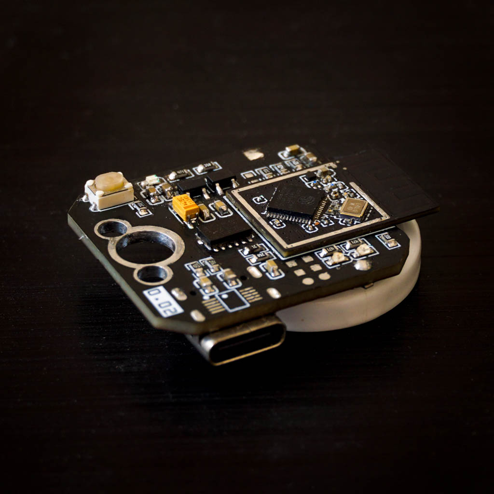
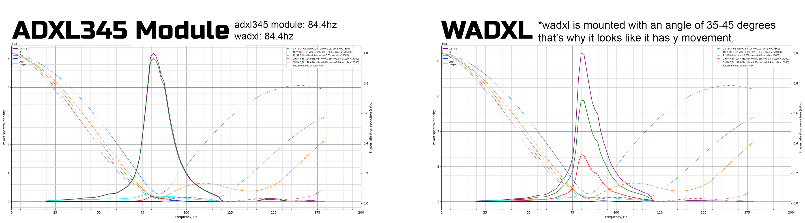
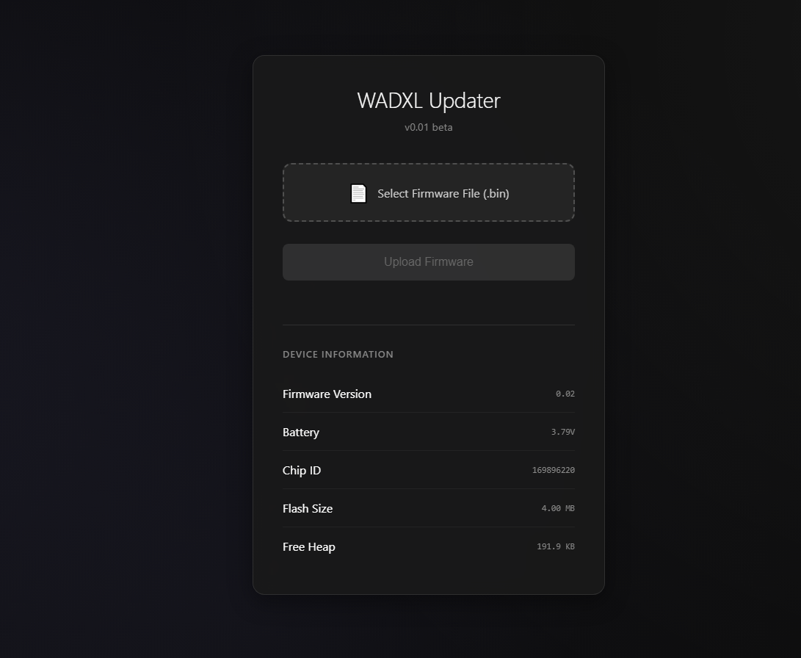

# Wireless ADXL for Klipper

## This is the public release of my wireless ADXL project developed for Klipper resonance testing. I originally built this as a commercial product but due to budget restrictions I could not move it into production. Instead of shelving it, I decided to release everything here so the community can benefit from it.
The full projects source is now fully available. Hardware, firmware and host-side tools are included.


## If you find the project useful and want to support future work, you can donate here:  
<a href="https://www.buymeacoffee.com/arteuspw" target="_blank"></a>



## What This Project Provides

- Wireless ADXL345 sensor module for Klipper
- No USB cable required on the toolhead
- Stable and low-noise accelerometer data over Wi-Fi
- Compatible with Klipper resonance testing
- Full hardware design, firmware source and host utilities

## Contents

hardware: Gerber and BOM
firmware: MCU firmware  
host: Python client for Klipper integration  
docs: Setup guide and usage notes


## Docs:

### First the setup

1) Power it with a 5V source or battery using the battery mounting holes
2) A wireless network named WADXL should appear, connect to it
3) You should be redirected to wifi setup page, if you don't, go to 192.168.4.1
4) Enter your ssid and password 

You should be connected successfully

### The OTA updater GUI :


- Go to wadxl.local (if that doesn't work, find it's ip in your router) you should see the ota page, that's where you can update it.

### Klipper setup:

- Run this command
```wget -qO- https://raw.githubusercontent.com/Pole-Engineering/Wireless-ADXL/main/software/install_wadxl.sh | bash```
- Klipper config:
```[wadxl]
ip = optional, entering the ip manually is better

[resonance_tester]
probe_points = 117.5,117.5, 10
accel_chip = wadxl
accel_per_hz = 160
min_freq = 20
max_freq = 120
```
### What does various patterns of LEDs mean

**RED on GREEN off:**
-Faulty ADXL or Error
**RED off GREEN on:**
-Standby mode
**RED blinking GREEN off:**
-Low voltage, charge 
**RED off GREEN blinking:**
-Sampling in progress
**RED blinking GREEN blinking:**
-Connecting to wifi


No leds will turn on before the initial setup when you boot it first time.

## Please note that this version is actually updated and not tested (it has better battery protection implementation.) so, if you spot some mistakes, please create an issue on github.

## License

Shield: [![CC BY-NC-SA 4.0][cc-by-nc-sa-shield]][cc-by-nc-sa]

This work is licensed under a
[Creative Commons Attribution-NonCommercial-ShareAlike 4.0 International License][cc-by-nc-sa].

[![CC BY-NC-SA 4.0][cc-by-nc-sa-image]][cc-by-nc-sa]

[cc-by-nc-sa]: http://creativecommons.org/licenses/by-nc-sa/4.0/
[cc-by-nc-sa-image]: https://licensebuttons.net/l/by-nc-sa/4.0/88x31.png
[cc-by-nc-sa-shield]: https://img.shields.io/badge/License-CC%20BY--NC--SA%204.0-lightgrey.svg
